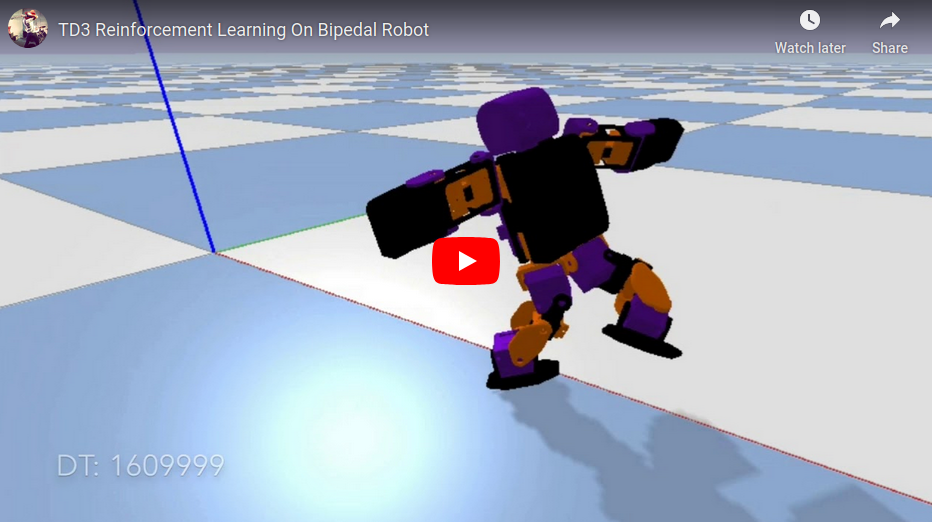
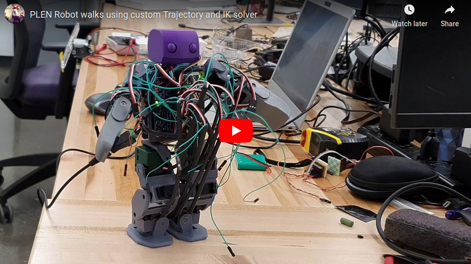
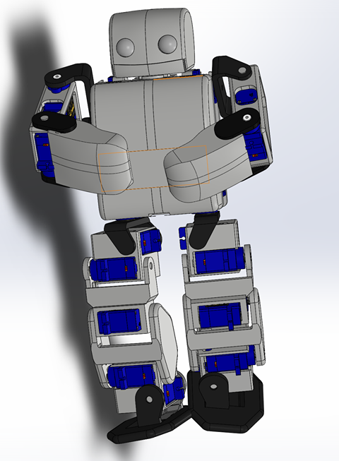

# PLEN Learns To Walk!

## Project Overview

For this project, I took the CAD files from the [PLEN](https://plen.jp/wp/en/) robot and turned them into OpenAI Gym environments in Pybullet and Gazebo via URDF. Then, I applied Twin-Delayed Deep Deterministic Policy Gradient (TD3) Reinforcement Learning to learn a gait. Finally, I built the real robot and tested my learned policy. I used OpenAI Gym so you can just plug and play your code!

As the sim-to-real experiment was unsuccessful, I implemented a simple sinewave-based trajectory for the robot's feet and solved the `Inverse Kinematics` using [this paper](https://www.hindawi.com/journals/mpe/2015/437979/). Based on this implementation, I learned that the robot needs wider hips, a lower CoM, and higher-torque motors for any RL policy to be deployed. Here's a video of the manual trajectory:

The core project components were:

* `Pytorch` to construct the six deep neural networks required by TD3 Reinforcement Learning.
* `PyBullet` for simulating the robot and environment.
* `RViz and Gazebo` for an alternate ROS-based simulation, as well as for constructing and testing the URDF mechanically and dynamically.
* `The Real Robot` was 3D printed and can be controlled using either joint position replay, or by sampling actions from a policy.

To read the theory behind each element of this project, please visit my [portfolio website](https://moribots.github.io/project/plen)

## Quickstart guide
* `fork` this repository, then download and build using `wstool` and `catkin_make` if you want to use the Gazebo Environment.
* To run the Gazebo training script, `source` your workspace, and write `roslaunch plen_ros plen_walk.launch td3:=True`
* To run the Pybullet training script, simple navigate to `plen_td3.py` under the `src` directory in the `plen_bullet` package, and run.
* To evaluate a policy in Pybullet, navigate to the above directory, and run `walk_eval.py`. You will need to open the file and edit the policy `number` to choose a different one.
* To evaluate the manual trajectory in Pybullet, navigate to the above directory and run `trajectory_eval.py`. Feel free to go one directory deeper into `trajectory_generator.py` and edit the gait parameters to your liking.
* To run  a policy or to replay a trajectory on the real robot, you will need to send the `plen_real` package to the robot's Raspberry Pi. Then, navigate into that package's `src` directory, and run `plen_real.py` and follow the instructions on screen. To deploy a policy, you will need to run `main_plen_walk_pc.py` on your computer to send the robot's pose as measured by an overhead camera. Note that you will need to calibrate the [camera](https://www.fdxlabs.com/calculate-x-y-z-real-world-coordinates-from-a-single-camera-using-opencv/) and [IMU](https://teslabs.com/articles/magnetometer-calibration/) following the instructions linked. 
* Finally, if you would like to use your own RL script on this robot, you can do so by importing `plen_env.py` either from the `plen_bullet` or `plen_ros` packages and use them as you would any other OpenAI Gym Environment.

## Dependencies
* ROS Melodic
* Gazebo
* Pytorch
* Pybullet
* Gym
* Numpy
* [Adadfruit Servo Toolkit](https://learn.adafruit.com/adafruit-16-channel-servo-driver-with-raspberry-pi/using-the-adafruit-library)
* [Adafruit Sensor Toolkit](https://learn.adafruit.com/reading-a-analog-in-and-controlling-audio-volume-with-the-raspberry-pi/necessary-packages)

## Packages

### `plen_bullet`

This package holds the `Pybullet` implementation of the project. The `src` directory contains  the training script, `plen_td3.py`, the policy evaluation script `walk_eval.py`, and the manual trajectory evaluation script `trajectory_eval.py`. Move one directory below, and you will see `plen_env.py`, which contains the OpenAI Gym and Bullet interface, as well as `trajectory_generator.py`, a script used to generate sinewave trajectories for the robot's feet, along with corresponding joint angles found using an analytical Inverse Kinematics solver.

### `plen_real`
This package holds the live implementation of this project. This package should be sent to the robot's Raspberry Pi Zero W, and the `plen_real.py` script should be run there. The `main_walk_pc.py` script should be run on the host computer, as it records the robot position using OpenCV in the `object_detector.py` script, and sends it to the Pi using `sockets`. The robot's motors are controlled using the `servo_model.py` script which contains the `ServoJoint` object with actuation and measurement capabilities. The IMU is controlled using the `imu.py` script containing the `IMU` object with measurement and calibration capabilities. Finally, the UDP Client and Server objects are located in the `socket_comms.py` script.

### `plen_ros`
This was the first package in the project, and for this reason contains the TD3 RL implementation which the other packages borrow from. It also contains the Gazebo equivalent of `plen_bullet`, but it is not recommended for use unless you have a Quadrupedal robot to simulate, as Gazebo's inability to deterministically step a simulation makes it difficult to train bipedal robots due to the variable amount of time required for training the Agent, which makes realtime training tricky.

This package also contains the `urdf` files for the robot in `xacro` format. This needs to be converted to `urdf` for use in Pybullet, which is why the `plen_bullet` package contains its own `urdf`, identical to the one here.

## CAD files

The files presented in the `cad` directory were modified to fit 9g servo motors, as well as a Raspberry Pi and PWM board instead of the stock components recommended by the PLEN Project Company.

## Required Components & Assembly

* [Raspberry Pi Zero W](https://www.adafruit.com/product/3400)
* [PWM Board](https://www.adafruit.com/product/815)
* [FS90-FB Servo Motors](https://www.pololu.com/product/3436) or TowerPro 9g
* [IMU](https://www.adafruit.com/product/3387)
* [60FPS Camera](https://www.gamestop.com/video-games/pc/accessories/cameras-and-webcams/products/kiyo-ring-light-equipped-web-camera/162981.html?utm_source=sdi&utm_medium=feeds&utm_campaign=PLA&utm_kxconfid=t9vz73bvj&gclid=EAIaIQobChMIq4G_gN2n6AIVzv7jBx1vbghMEAQYASABEgIstvD_BwE&gclsrc=aw.ds) for pose tracking (sim runs at 60Hz)
* [4.8V Battery](https://www.pololu.com/product/2231)
* [ADC](https://www.adafruit.com/product/856)
* [Force Sensing Resistor for Foot Contact](https://www.adafruit.com/product/166)

For assembly instructions, please follow [this guide](http://plen.jp/playground/wiki/tutorials/index.html) by the PLEN Project Company. Feel free to use the `servo_calibration_basic.py` script to help you align the servo horns. Note that a software offset of 9 degrees was applied to each servo motor (see `plen_real.py` in `plen_real`) to zero them properly.

## Future Work
One method of closing the sim-to-real gap is to increase the fidelity of the simulation. This has been done for [quadrupedal robots](https://arxiv.org/abs/1804.10332) in Pybullet, so it should be possible for PLEN as well. In addition, I noticed that Gazebo more accurately represents contacts, so an alternate or parallel route for improvement would be to implement a plugin to deterministically step the simulation while still applying joint commands.

Finally, while this was not my original goal, I inadvertedly dove into [Zero Moment Point trajectory generation for bipedal robots](https://arxiv.org/pdf/1510.03232.pdf) during the final week of this project. Although the topic requires significantly more research for me to implement (hence why I opted for open-loop sinewave-based foot trajectories), it is definitely worthwhile. It would be interested to apply a ZMP-based gait, and use RL to improve upon it.